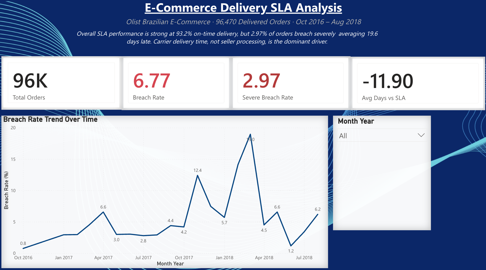
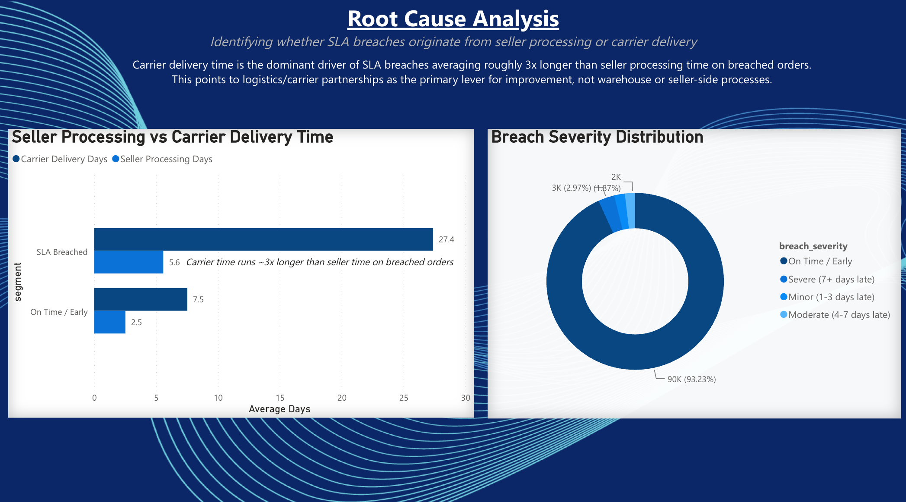
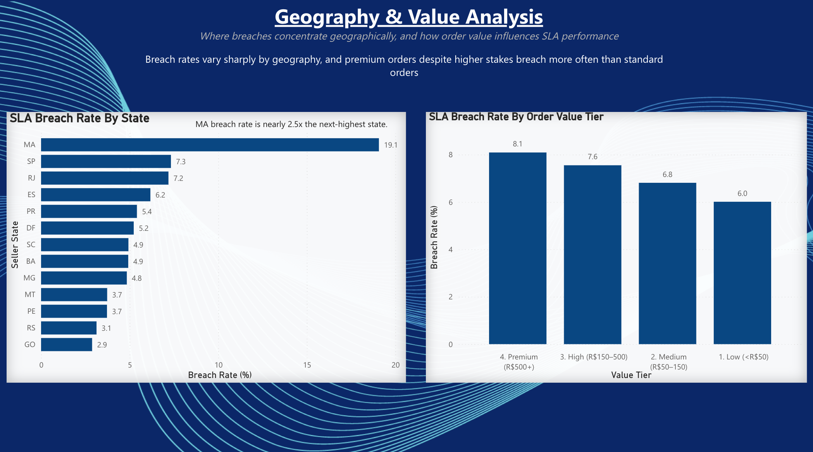

---

## 🛠️ Tools & Technologies


---

## 📈 Charts

### 1. Monthly SLA Breach Rate Trend
Performance improved overall (2016→2018) but with two critical spikes 
November 2017 (12.4%) and March 2018 (18.96%) both coinciding with
peak order volumes. Suggests logistics capacity couldn't scale with growth.

### 2. Breach Severity Breakdown
93.2% of orders arrive on time or early. Of the 6.77% that breach,
nearly half are severe (7+ days late) averaging 19.6 days late.
The headline rate understates the severity of the worst cases.

### 3. Seller vs Carrier Time Split
Carrier delivery accounts for 73% of total delivery time overall.
On breached orders, carrier time is 3.6x longer than on-time orders
a parcel delayed at seller stage misses optimal carrier routing,
compounding the original delay. Direct parallel to DPD depot operations.

### 4. Breach Rate by Seller State
Only 3 of 13 states exceed the platform average. MA is a significant
outlier at 19.07%. SP drives the most absolute breached orders (5,015)
due to its dominant volume 71% of all platform orders.

### 5. Breach Rate by Order Value Tier
Premium orders (avg R$930) breach at 8.09% vs 6.01% for low-value orders.
The platform's most valuable customers receive the worst delivery experience
a direct customer retention and lifetime value risk.

---

## 🗄️ SQL Analysis

8 business questions answered using SQLite in Python.
Full queries available in [`sql/sla_queries.sql`](sql/sla_queries.sql)

| Query | Business Question | Key Finding |
|---|---|---|
| Q1 | Overall SLA performance | 6.77% breach, avg 11.9 days early |
| Q2 | Breach severity breakdown | 2.97% severe, avg 19.6 days late |
| Q3 | Monthly trend | Improving; Mar 2018 peak at 18.96% |
| Q4 | Seller vs carrier split | Carrier 3.6x longer on breached orders |
| Q5 | Breach by seller state | MA worst 19.07%, 3 of 13 above average |
| Q6 | Worst performing sellers | 8 of 10 in SP; worst at 36.36% |
| Q7 | Breach by order value | Premium orders breach most at 8.09% |
| Q8 | Breach by day of week | Monday worst 7.44%, gap of 1.22pp |

---

## 🚀 How to Run

### Prerequisites
```bash
pip install pandas numpy matplotlib seaborn openpyxl
```

### Steps
```bash
# 1. Clone the repo
git clone https://github.com/gurvinder604/ecommerce-sla-analysis.git
cd ecommerce-sla-analysis

# 2. Download dataset
# Go to: kaggle.com/datasets/olistbr/brazilian-ecommerce
# Download all CSV files and place in data/raw/

# 3. Run notebooks in order
# 01_cleaning.ipynb     → produces data/clean/orders_clean.csv
# 02_sql_analysis.ipynb → 8 SQL business queries
# 03_eda_charts.ipynb   → 5 charts + Power BI export files

# 4. Open Power BI dashboard
# Open powerbi/ecommerce_sla_dashboard.pbix in Power BI Desktop
```

---

## 📊 Power BI Dashboard

A 3-page interactive dashboard built to communicate these findings to a non-technical business audience structured to answer three sequential questions: *How are we performing? Why are we breaching? Where and for whom does it hurt most?*

### Page 1 — Overview


Headline SLA performance across 96,470 delivered orders: 6.77% overall breach rate, 2.97% severe breaches, and the full breach rate trend from Oct 2016 to Aug 2018.

### Page 2 — Root Cause Analysis


Isolates whether breaches originate from seller processing or carrier delivery. Carrier delivery time runs roughly 3x longer than seller processing time on breached orders pointing to logistics partnerships, not warehouse operations, as the primary lever for improvement.

### Page 3 — Geography & Value


Breach rate by seller state and order value tier. Maranhão (MA) breaches at 19.1% over 2.5x the next-highest state (São Paulo, 7.3%). Premium orders (R$500+) breach more than any other value tier, a counterintuitive finding given their higher stakes.

📥 [Download the dashboard (.pbix)](dashboard/ecommerce_sla_dashboard.pbix)

## 🏢 Business Recommendations

1. **Target severe breaches first** — 2.97% of orders average 19.6 days late. Fix these before optimising the 6.77% headline rate
2. **Focus on SP-based sellers** — 8 of 10 worst sellers are in São Paulo. A targeted seller improvement programme here has the highest ROI
3. **Protect premium customers** — R$500+ orders breach most (8.09%). Priority handling or tighter seller SLAs for high-value orders would reduce churn risk
4. **Build logistics capacity before peak periods** — Q1 2018 showed the platform cannot scale. Buffer capacity must be pre-built before holiday seasons
5. **Investigate carrier routing for late-starting orders** — carrier time 3.6x longer on breached orders suggests missed routing windows compound seller delays

---

## 👤 About

**Gurvinder Singh**
Data Analyst | Python | SQL | Power BI

- 🎓 BSc Computer Science (2:1) — University of West London
- 📜 IBM Data Analyst Professional Certificate
- 💼 1 year of delivery operations experience (DPD UK) — informed this project's domain understanding
- 🔗 LinkedIn: [linkedin.com/in/gurvindersingh2002](https://linkedin.com/in/gurvindersingh2002)
- 🐙 GitHub: [github.com/gurvinder604](https://github.com/gurvinder604)

---

## 📄 Data Source

Olist Brazilian E-Commerce Public Dataset
Available at: [kaggle.com/datasets/olistbr/brazilian-ecommerce](https://kaggle.com/datasets/olistbr/brazilian-ecommerce)

> ⚠️ Raw and clean data files are not included in this repository.
> Download from Kaggle and place CSV files in `data/raw/`.

---

*Built as part of a data analyst portfolio — July 2026*
